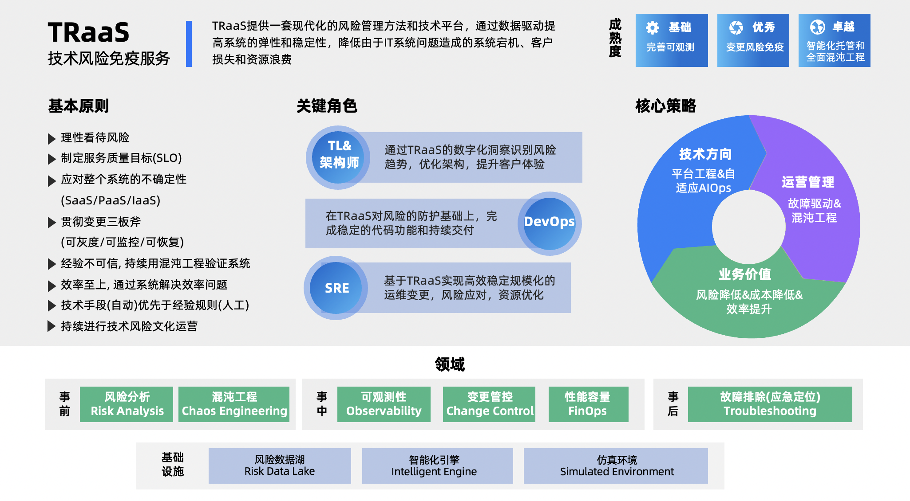

### 欢迎来到TraaS的世界
**Welcome to TraaS World！**
本书是对TraaS(TechRisk as a Service，技术风险免疫服务)的系统性介绍，全书包括理论篇、组织篇、领域篇、学术研究篇、案例篇等篇章，其中理论篇、组织篇、领域篇侧重方法论的阐述，学术研究篇汇集相关的学术研究成果，案例篇展示相关的优秀实践案例。

### 适合阅读本书的读者
本书面向的读者包括：技术管理者，企业级开发者，学术界研究人员，求职者，以及所有对技术风险相关领域感兴趣的人们。
