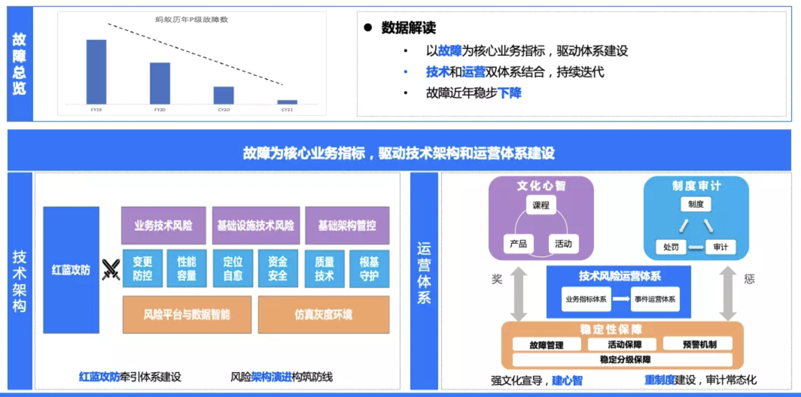
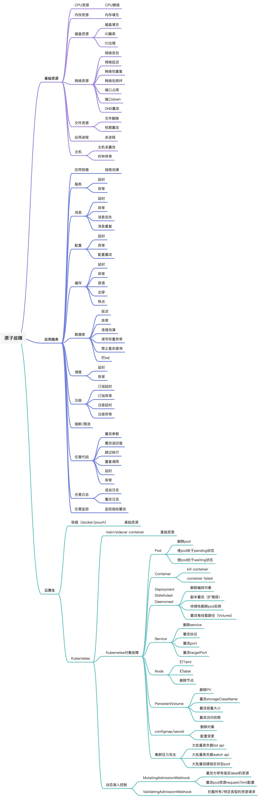

### 一、混沌工程概述
#### 1、混沌工程的定义
对于混沌工程的定义，目前业界普遍采用《混沌工程原则(Principles of chaos engineering)》一书中的描述，其英文原文是：
_**Chaos Engineering is the discipline of experimenting on a system in order to build confidence in the system’s capability to withstand turbulent conditions in production.**_
直译成中文是：
_**混沌工程是在系统上进行实验的学科, 目的是建立对系统抵御生产环境中失控条件的能力以及信心。**_

这个定义，对于没有混沌工程实践经验，或者刚刚接触混沌工程领域的工程师来说，有一定理解难度，对其中的几个关键词进行进一步解释后，能够更加方便理解：
**系统**：主要指软件系统，通常多指大规模分布式软件系统。
**实验**：主要指故障注入，在系统内部进行具备破坏性的行为。
**失控条件**：主要指系统处于发生故障的状态，此时系统处于一种“失控”的状态。
**抵御能力**：在分布式系统稳定性方面，系统需要对故障具备防御能力。

那么，混沌工程的定义可以较为通俗解释为：
**对大规模分布式软件系统进行故障注入，目的是检验系统在生产环境中发生故障时的防御能力，进而建立系统稳定性方面的信心。**
#### 2、混沌工程的实践形式
根据定义，混沌工程的两个关键要素应为“故障注入”和“故障防御”，也可以解释为“攻击”和“防御”，其目的是通过攻击“检验”防御，有着“演练”的含义，因此，目前业界普遍采用“攻防演练”作为混沌工程的主要实践形式。
在部分企业的实践中，“攻防演练”又称作“红蓝攻防”，该名词中的“红蓝”是指“红军”和“蓝军”，其中，“蓝军”负责攻击（注入故障），“红军”负责防御（发现并消除故障）。
红蓝的概念来源于军事领域：在部队的模拟对抗演习中，蓝军扮演假想敌的部队，红军代表我方正面部队，蓝军可以模仿世界上任何一支军队的作战特征与红军进行针对性的训练。
#### 3、红蓝攻防的组织架构
红蓝攻防在企业内部落地，关键是蓝军和红军两支团队的组建，可采用的组织架构为：

- 若企业有专门组建SRE团队，可在该团队内部组织独立的蓝军和红军团队，专职负责攻防演练工作；
- 由业务研发测试团队的部分工程师，兼职蓝军和红军，部分工作职责是攻防演练，即虚拟的蓝军和红军团队。
#### 4、红蓝攻防的重要意义
技术风险工作由故障驱动，减少故障是主要目标，各种防控系统的能力，除了通过真实故障进行检验之外，更重要的是在平时通过红蓝攻防进行能力的保鲜，保证其在真实故障到来时发挥预期的作用。随着技术风险工作的深入，故障数量会呈现逐步下降的趋势，此时更加不能忽视系统能力的保鲜，同时人的能力也要在这种形势下通过红蓝攻防有效保持。
红蓝攻防也是一种技术风险文化，通过红蓝攻防不断建设技术人员的风险心智。对风险保持敬畏，以安全生产为根本，才能不负客户之重托。

### 二、混沌工程在分布式系统稳定性领域的实践
#### 1、前言
混沌工程主要应用于分布式系统稳定性领域，虽然其定义中包含攻防两个方面，但实际上混沌工程主要专注在攻击(故障注入)，防御则分布于稳定性领域的各个方面，例如变更，容量，监控，应急定位等。
在这部分内容中，将重点围绕“稳定性领域的混沌工程实践”的话题展开叙述。除了稳定性领域，混沌工程也可应用于其他领域，将在第三部分的混沌工程实践扩展中叙述。
#### 2、故障场景
##### 故障场景定义
故障场景的定义可由如下公式描述：
**_故障场景 = 故障能力+ 作用范围 + 生效环境_**
生效环境：“在哪里注入故障”，指故障注入发生的环境，虽然在混沌工程的定义中出现了“生产环境”的描述，但实际情况是并不对环境进行限制，故障注入可以在生产环境，预发环境，测试环境，开发环境等各种环境进行。
作用范围：“注入什么规模的故障”，指故障注入发生的系统，集群/机房，机器等。
故障能力：“注入什么故障”，故障注入的能力，通常抽象为一些原子化的能力。
##### 原子故障能力
原子故障能力的大图如下：

按照软件系统类型，可将原子故障能力分为基础资源，应用服务，云原生三大类型。
**基础资源**：基础资源消耗是常规的故障能力，既可以作用于应用服务，也可以作用于云原生对象(容器等)，所以将其独立成为一类。
**应用服务**：应用服务类故障主要包括两类，一是应用依赖方面，例如服务，消息，存储，配置，定时任务等；二是应用自身逻辑方面，例如任意代码、任意日志、任意监控等。应用服务故障没有实现语言的限制。
**云原生**：云原生类故障指K8S体系的故障，主要是K8S各类对象的故障，另外还包括动态准入控制等。
#### 3、故障注入技术
故障场景中的原子故障能力，可由多种故障注入技术实现，常用的故障注入技术有以下几类：
##### 应用切面技术
应用服务类的原子故障能力大多可通过应用切面技术实现，应用切面技术能够做到在应用进程运行时，拦截函数调用，在此基础上实现函数调用延时，函数调用异常，修改函数的参数和返回值等注入行为，拦截既可作用于应用对外部依赖的调用（实现各类依赖的故障注入），也可作用于应用内部的调用（实现应用任意代码，任意日志的故障注入）。
典型的应用切面技术有，JAVA语言中的Java agent技术，等等。
##### 脚本技术
基础资源消耗类的原子故障能力大多可通过脚本实现，例如shell，go等。
##### K8S相关技术
云原生中K8S对象的原子故障能力，可通过K8S的yaml和apiserver等技术实现，通过yaml向apiserver提交“期望状态”的方式，实现各种原子故障能力。
##### 技术产品内置故障注入
分布式稳定性领域的技术产品，部分内置有故障注入能力，典型的如蚂蚁内部监控产品AntMonitor，内嵌故障注入模块，可实现任意监控指标的注入。
#### 4、影响控制(爆炸半径)
混沌工程领域有个名词叫做“爆炸半径”，可通俗解释为故障注入的影响程度。控制爆炸半径，即控制故障注入的影响程度。
##### 影响控制的粒度

- 机器粒度：包括影响的应用，集群，机器等，基本等同于故障场景三要素中的“作用范围”。
- 流量粒度：通常用于应用服务类的故障注入，这类故障大多基于流量触发，例如应用访问数据库超时。流量粒度有时也称作线程粒度，控制方式包括流量数和流量特征(真实/测试流量，业务/用户标识等)。流量控制有更强的业务语义，控制粒度更加精细，例如可以将故障注入控制在“某类业务的某些用户的X次访问”的粒度。
##### 有损注入和无损注入
控制爆炸半径的最终目的是尽可能降低故障注入对软件系统的影响，有影响的故障注入，可以称为“有损注入”，相对地，“无损注入”是指达成故障注入目的的同时，对系统不产生影响的一种注入方式。
例如，对于应用调用服务异常的故障能力，有损注入的方式是使用应用切面技术，拦截真实的服务调用函数并返回异常；无损注入的方式同样可使用应用切面技术，不过拦截的不是真实的服务调用，而是服务调用的日志打印函数，篡改日志内容，最终也能够在服务监控指标上出现异常，此时系统的服务调用仍然是正常的。
无损注入应用于攻防演练，由于注入对系统不产生影响，可以不进行应急恢复，所以能够扩大演练规模，提高演练频次，对演练常态化有较大帮助。
无损注入是一种注入方式，实现技术可以有多种，例如，日志注入(篡改日志内容，追加异常日志)，监控注入(篡改监控指标)等。
有损注入和无损注入的边界有时较为模糊，严格来讲，系统日志或监控指标出现异常，也可能会有业务影响(影响离线分析等业务)，这里旨在提供一种思路，实践时需要具体问题具体分析。
#### 5、度量和可观测性
软件系统在演练的过程中，其状态会经历从“稳态(故障注入前)”到“故障态(故障注入后)”再到“稳态(故障恢复)”的过程。系统具备可观测性是演练的必要条件，可观测指标包括软件系统的基础指标(CPU，内存等)，服务指标(SAL, DAL, CAL等)，业务指标(业务成功率，失败量等)，等等。
度量是对演练目标进行定性和定量的结论性说明。演练之前设定度量目标，例如某次演练的目标是，故障的5分钟发现率需要达到99%以上，10分钟恢复率需要达到95%以上。在演练完成后，定性和定量的给出结论，例如本次演练是否达成预期目标(定性)，本次演练的5分钟发现率和10分钟恢复率分别是多少(定量)。
度量是一次完整的演练活动中不可或缺的环节，是直观反映演练效果的重要方法，可观测性是度量的前置条件。
#### 6、持续集成
Martin Fowler对持续集成的定义为：“持续集成是一种软件开发实践，即团队开发成员经常集成他们的工作，通常每个成员每天至少集成一次，也就意味着每天可能会发生多次集成。每次集成都通过自动化的构建（包括编译，发布，自动化测试)来验证，从而尽快地发现集成错误。许多团队发现这个过程可以大大减少集成的问题，让团队能够更快的开发内聚的软件。”
从持续集成的定义可以看出，其主要特点是通过自动化的方式高频率进行集成，从而能够更快发现并解决软件缺陷，提高软件质量，减少验证和发布新软件更新所需的时间。持续集成虽然是一种软件开发实践，但也可以应用于混沌工程领域。混沌工程通过攻防演练的形式，发现并解决软件系统稳定性方面的问题，引入持续集成的实践后，演练活动能够做到更加高频，更快发现并解决稳定性方面的问题。
攻防演练的持续集成，对于业务复杂，系统规模庞大，变更频繁的企业尤其适用，因为风险时时刻刻都可能引入，所以需要像回归测试用例一样回归演练场景，只有这样才能够及时快速的发现并消除风险。
攻防演练的持续集成，其技术要点主要包括：

- 演练自动化，其中的关键是度量自动化。
- 演练零打扰或低打扰，即对业务和系统尽可能不产生影响，并且对研发人员尽可能不产生打扰，可以考虑采用无损故障注入，演练告警隔离等技术。
#### 7、演练报告
演练报告是对演练活动的总结，演练对系统稳定性的提升之所以能够带来帮助，演练报告在其中发挥着相当重要的作用。一份完整的演练报告，通常包括如下内容：

- 演练的目的
- 演练的实施时间和参与人员
- 演练的目标业务，系统和环境
- 演练执行的故障场景
- 演练的度量结果
- 发现的主要问题及Action

演练需要定期组织，通过连续的演练报告对比，能够分析出系统稳定性水平的变化情况，对系统稳定性的工作具有重要的指导意义。
### 三、混沌工程实践的扩展
#### 1、业务风险混沌工程
稳定性混沌工程具有普适性的特点，无论业务是什么类型，都可以运用这套实践方法论来提升系统稳定性。
业务风险混沌工程是面向业务的混沌工程实践，其形式与业务特征有着紧密的联系。下面举几例进行说明：

- 对于支付业务，或者泛金融业务，资金逻辑的正确性极其重要，混沌工程可以注入资金相关的错误，例如篡改系统资金属性的数据，有损的方式是直接篡改写入数据库的数据，无损的方式可以仅注入对账系统。
- 对于营销业务，营销人群是关键的业务逻辑，混沌工程可以注入人群相关的错误，例如人群圈定错误，另外也可以针对营销发放的奖品逻辑进行数量篡改等注入。
- 对于电商业务，库存逻辑是核心，混沌工程可以注入库存相关的错误，例如库存扣减时多扣或少扣等。

面向业务风险的混沌工程，需要具体业务具体分析，设计不同的实践形式。
#### 2、研发质量混沌工程
研发质量混沌工程是面向研发过程的混沌工程实践，其主要参与研发过程的开发和测试两个阶段，具体举例如下：

- 对于开发阶段的Code Review操作，如何判断Code Review人是否认真执行，可以利用混沌工程的视角，在研发人员提交代码时，注入与开发规范违背的变异代码，并观测Code Review人是否发现。
- 对于测试阶段的测试用例而言，测试用例必须要有完整、恰当的断言来保证测试用例能够起到回归业务并发现问题的作用，即用例是有效的。如何判断用例已经达到有效状态，可以利用混沌工程的方式，通过不断的对业务代码进行变异并执行测试，判断测试用例是否能够识别到变异，进而分析出测试用例的有效情况。

研发质量混沌工程主要在业务上线前进行实践，能够降低潜在风险进入生产环境的概率。
### 附1、常用开源工具
chaosmeta: 蚂蚁集团开源的自动化混沌工程技术([https://github.com/traas-stack/chaosmeta](url))
chaosblade: 阿里巴巴开源的混沌实验工具（[https://github.com/chaosblade-io/chaosblade](url)）  
chaosmesh: 面向云原生的混沌实验工具（[https://github.com/chaos-mesh/chaos-mesh](url)）
