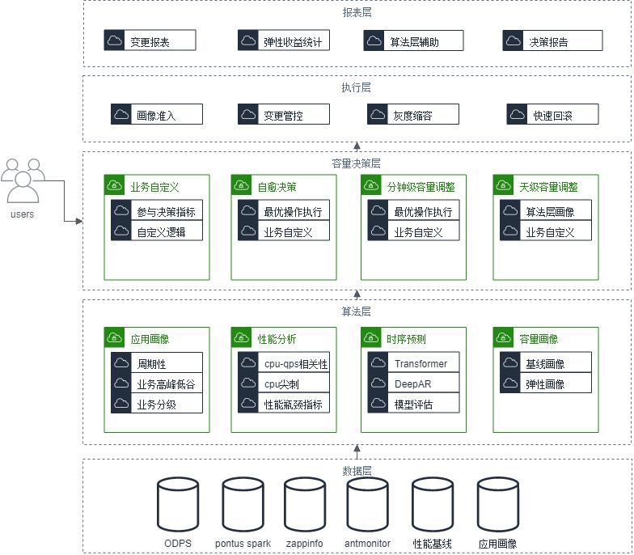
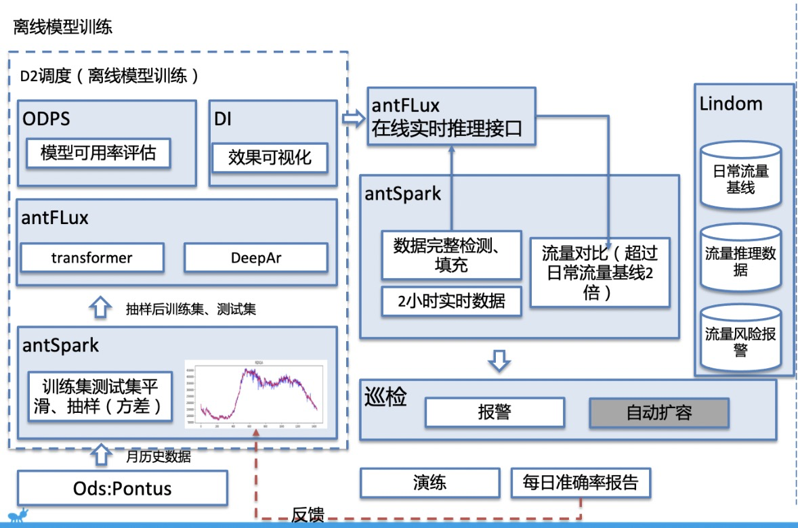
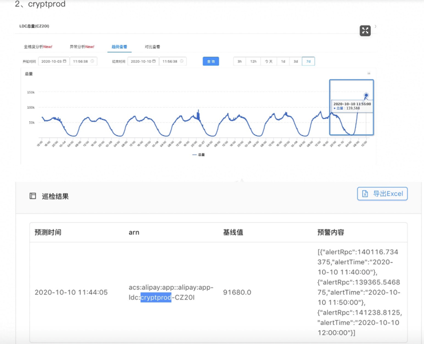
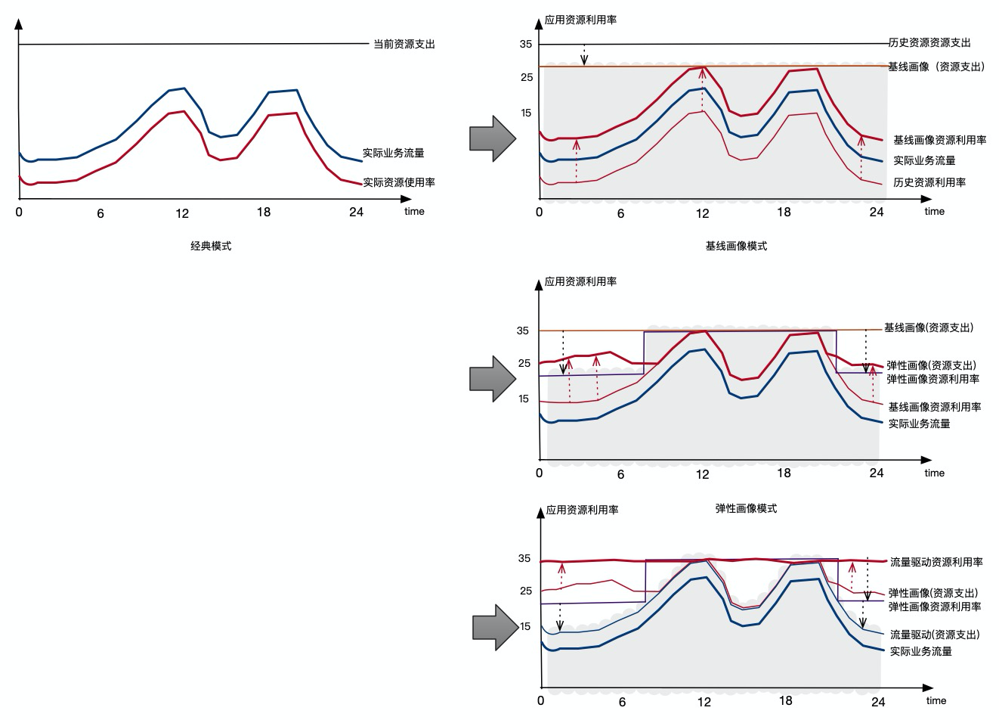
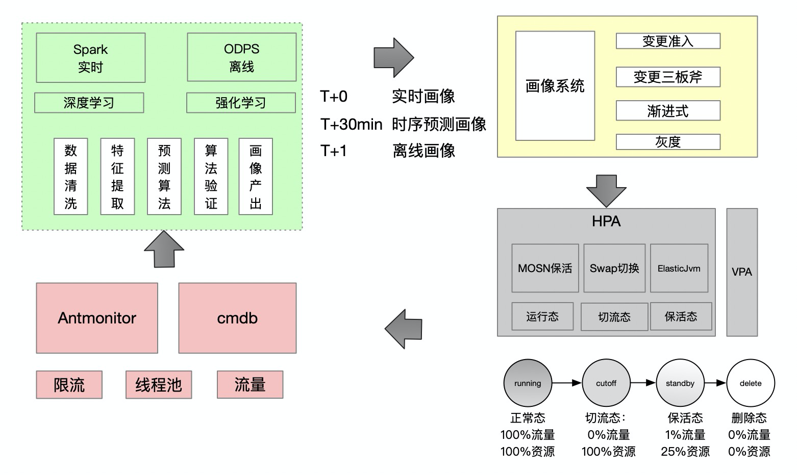
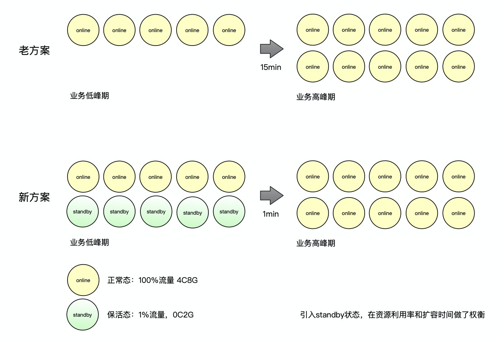
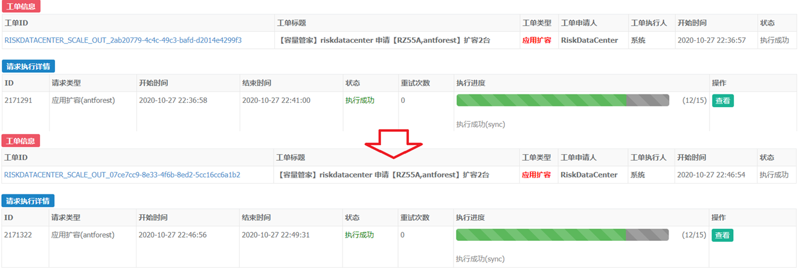
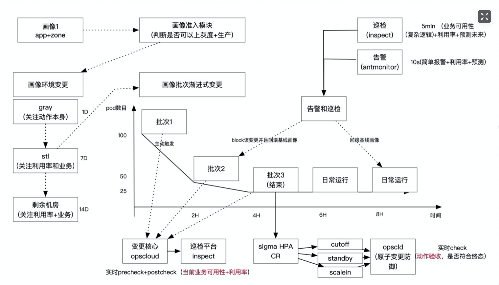
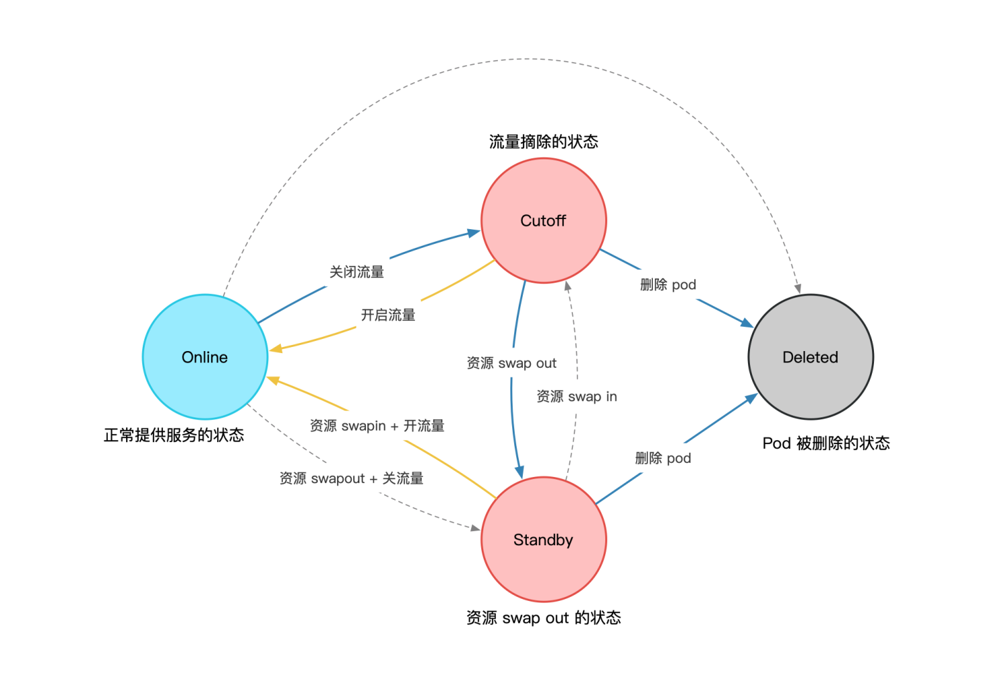

## 水平弹性伸缩HPA介绍
HPA的意思是Horizontal Pod Autoscaling，意即自动增加减少容器。最理想的情况是，每时每刻的容器数量刚好够应用当时的业务需求用，达到成本和业务需求的完美平衡点。
在引入k8s之前，蚂蚁的PaaS扩缩容操作是面向过程的，并通过人工+压测等手段去评估容器够不够，随之带来的效能问题，资源浪费问题，容量故障问题都非常严重。在云原生的浪潮下，蚂蚁的当前的基础设施底盘Sigma 3.0已经是以k8s为基础构建的，原生就提供了面向终态交付容器的能力，因此在此基础上构建弹性能力也变得相对简单。然而我们做了调研后发现，k8s等开源社区具有的HPA技术并不能直接在蚂蚁落地，原因有：

- 由于蚂蚁的金融属性业务稳定性要求高，历史原因导致的业务复杂性也很高，从而使得弹性伸缩变成一件高风险的事，需要建设技术风险控制手段，防止因为监控数据或组件异常导致故障
- 蚂蚁在线应用扩缩容速度需要10分钟以上，扩缩容无法满足快速弹性的要求。
- 原生的基于metrics直接指导扩缩容的逻辑过于简单，一些情况下可能进行其他操作更合适。举例来说，蚂蚁的SOFA应用线程池block队列满了而cpu/mem利用率不高，这个时候最优的解法可能是动态调整线程池而不是直接扩容。因此HPA不能自闭环去解决线上容量性能问题，需要有更上层的协调层进行决策。

针对上面的这些原因，我们需要自研设计适合蚂蚁生产环境使用的容量托管弹性方案。我们主要进行了以下的设计：

- 容量稳定性-主动/被动保障
   - 接入变更管控平台，发现问题可自动阻断和回滚
   - 开启日常巡检进行各项系统逻辑检测和告警
   - 采用渐进缩容，分批调整
- 容量稳定性-快速恢复
   - 引入多阶段缩容，通过切流和保活作为缩容前的观察阶段，在有问题发生情况下可以秒级/分钟级恢复
- 容量决策
   - 构建数据算法层和容量决策层，通过离线数据勾画出的应用的各种特征画像，结合实时监控数据进行决策。目前已经上线的功能有容量自愈（自动发现容量问题，问题发生后把容器切回running+扩容），T+M自动扩容（最早提前30分钟发现未来的容量问题，提前进行容器状态切回running+扩容），正在开发中的有线程池自动调整，等等

系统设计大图

### 核心算法层
算法层的主要作用是找出有业务规律性的应用，对整体集群做出调优的决策，扩多少，缩多少，什么时候进行弹性伸缩都是由算法层计算得出。对有周期性规律的应用（蚂蚁大部分应用都属于有规律的应用），更可以通过对流量的时序预测进行未来容量问题的提前发现，在性能容量问题发生前就自动触发容量决策层的容量调优操作。下图为我们当前时序预测的整体设计图。

时序预测算法层设计

通过实时预测，我们可以在容量到达峰值前就能感知到异常。下面的例子说明，我们在日常2倍流量的峰值来临前15分钟自动感知到了流量异常。

提前N分钟发现容量异常上涨，在引发故障前进行容量调优决策
### 弹性策略
对于日常规律性的弹性伸缩，我们在策略上采用基线画像压缩峰值水位，弹性画像提升均值水位的多阶段画像方案进行在线利用率提升

基线/弹性画像

执行流程示意图

在算法层得出基线/弹性画像之后，经由决策层把最终画像传给执行层进行面向画像期望的弹性容量操作。以日级别的弹性画像更新为例，通过算法层结合通用指标和应用特性的分析得出应用什么时候该扩容，什么时候该缩容，扩多少，缩多少。通知容量决策层。决策层可根据业务自定义需求，结合通用的判定结果做出最终判断并且下发画像给执行层。如果是缩容，执行层将渐进变更，先切流/保活，并分批执行。如果是定时弹性伸缩，那么只会将容器切换到保活状态，不会进行缩容。
下图所示为执行层的管控界面，当决策需要弹性变更，最终画像录入执行层后，执行结果预估，水位变化的预估可以在界面上看到。

数据层产出的弹性画像应用后的预测效果

### 渐进变更&快速回滚
我们在操作的时候，会采用渐进分批的变更策略。例如原来A应用B zone下有10台容器，期望缩容到5台。那么我们会自动进行分批：10->8->6->5进行切流操作但是不把容器缩容掉。每次变更间隔一定时间（默认30分钟，可配置），并且会在切流到5台后停留较长观察期后才进行缩容操作（默认1天，可配置。因为蚂蚁大部分应用具备天周期性质），期间如果需要回滚或者扩容，可快速进行回滚。如下所示，切流/保活状态的应用分别可以在秒级/分钟级回滚到在线状态。在HPA功能刚上线的时候，算法层功能还不够完善，应用的性能瓶颈数据，是否可缩容等信息不够准确，正是由于我们具备了快速回滚功能，才保障了没有严重故障的发生。

保活切换示意图
此外，在大促中我们也接入了最新的基于fork的急速启动技术。试点应用启动时间从 4分2秒提升到了2分35秒。这项技术尚有优化空间，我们会继续使用最新的技术提升弹性的速度。

HPA对接急速扩容
### 容量稳定性
 在蚂蚁如此大的在线应用规模上落地弹性伸缩技术需要依赖于蚂蚁建设多年的技术风险工程体系，我们分为主动工程和被动工程，在主动工程侧我们进行了变更三板斧系统化的改造，实现准入+灰度环境+线上分批+防御的变更方案，基于容量异常检测算法进行变更时的检测和分钟级的周期巡检。在被动工程侧，容量技术组会定期进行相关的红蓝攻防做容量应急和自愈进行验收。如下图所示

HPA相关容量稳定性保障

我们建设了诸多变更拦截规则，举例来说，有一个兜底的拦截规则是根据应用N天内水位峰值估算缩容后容器数是否够，如果超过警戒线就不允许变更。同时，也有一些后置巡检规则，可以在变更后追踪业务error等指标判断我们的变更是否可能导致业务异常。
通过建设变更拦截和巡检能力，我们不仅保障了业务系统容量调整不会过大，保障了我们平台自身功能异常能够自动发现，还能发现一些我们之前没想到的情况，例如我们通过编写巡检规则检测容器是否在切流后还有残余流量的逻辑，发现了部分应用的流量会发生没切干净的bug，原有切流逻辑使用固定ip在容器替换后会有bug等诸多问题。
## Reference
### 什么是容器的切流和保活

- 切流：指把容器的入流量切干净的状态，但不阻碍出流量
- 保活：指把容器的内存资源出让，流量调整为1%的状态（为了防止切回running态时产生预热），这样cpu使用率也会降低，资源可以出让给离线业务使用。容器支持保活态的前提是应用接入mson并且配置了zengc
